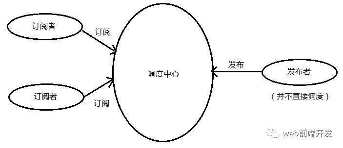
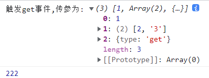
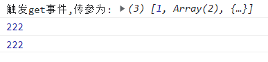
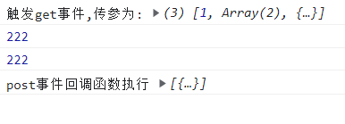

## 什么是TS实现发布订阅模式？
 类似addEventListenr

发布-订阅模式里面包含了三个模块，发布者，订阅者和处理中心。这里处理中心相当于报刊办事大厅。
发布者相当与某个杂志负责人，他来中心这注册一个的杂志，而订阅者相当于用户，我在中心订阅了这分杂志。
每当发布者发布了一期杂志，办事大厅就会通知订阅者来拿新杂志。
## 代码实现
Talk is cheap，show you my code

```ts
// 发布订阅模式
// on 监听/订阅
// emit 执行/发布
// once 只执行一次
// off解除绑定

interface EventDispatch {
  on: (name: string, callback: Function) => void,
  emit: (name: string, ...args: Array<any>) => void,
  once: () => void,
  off: (name: string, fun: Function) => void
}

// 一类事件，对应一个执行函数的数组
interface List {
  [key: string]: Array<Function>
}

// 调度派发中心
class Dispatch {
  // 管理着每一类事件
  list: List

  constructor() {
    this.list = {}
  }

  // 绑定/监听
  on(name: string, callback: Function) {
    const callbackList: Array<Function> = this.list[name] || []
    callbackList.push(callback)
    this.list[name] = callbackList
  }

  // 订阅/执行, 从第二个参数依次传给回调函数
  emit(name: string, ...args: Array<any>) {
    let events = this.list[name]
    if (events) {
      events.forEach(fn => {
        // 依次执行 该事件的所有回调，并传参
        fn.apply(this, args)
      })
    } else {
      console.error('该事件还未绑定！')
    }
  }

  // 解除对某事件函数的绑定
  off(name: string, fun: Function) {
    let events = this.list[name]
    if (events) {
      // 找到需解绑函数在 该事件函数数组的下标，再删除
      let index = events.findIndex(fn => fn === fun)
      events.splice(index, 1)
    } else {
      console.error('该事件还未绑定！')
    }
  }

  // 事件只触发一次 原理：对事件进行绑定后立马删除
  once(name: string, fn: Function) {
    // 复制临时函数
    let tem = (...args: Array<any>) => {  
      fn.apply(this,args)
      this.off(name,tem)
    }
    this.on(name, tem)
  }
}
```

## 代码测试

```ts
// 调度中心实例
const dispatch = new Dispatch()

function f1(...args: Array<any>) {
  console.log('触发get事件,传参为:', args);
}
function f2(...args: Array<any>) {
  console.log(222);
}

// 对get事件监听，可绑定多个函数
dispatch.on('get', f1)
dispatch.on('get', f2)
// 触发get事件
dispatch.emit('get', 1, [2, '3'], { type: 'get' })
```
### 执行结果如下：



```ts
// 解绑get事件的f1回调函数
dispatch.off('get', f1)
// 再次触发get事件
dispatch.emit('get', 1, [2, '3'], { type: 'get' })
```
### 执行结果如下：解绑的f1函数不再触发，仅触发f2



```ts
function f3(...args: Array<any>){
  console.log('post事件回调函数执行',args);
}
// once监听post事件
dispatch.once('post',f3)
dispatch.emit('post', {type:'post'})
dispatch.emit('post', {type:'post'})
dispatch.emit('post', {type:'post'})
dispatch.emit('post', {type:'post'})
```

### 执行结果如下：通过once绑定的事件，仅能触发一次

